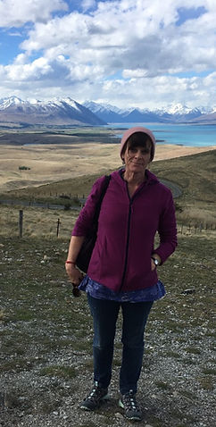

My therapy practice is grounded within an Integrative Tradition.

For more than twenty years I have worked as a therapist in a wide variety of contexts: hospital, community, residential and custodial settings, as well as in my private practice.

In 2014 I completed a four period of doctoral study. My thesis was entitled: The Creative Dance of Love and Consciousness,  and was the result of an integral inquiry into the experiences of Belonging and not-Belonging.

Having left as a Norfolk as a teenager, I am now back and living once again in the Breckland, the area in which I was born. 

I am the mother of four grown up children, and now also a proud grandmother - watching a growing new generation of younger ones. 

I love being outside in Nature, walking and wild swimming.